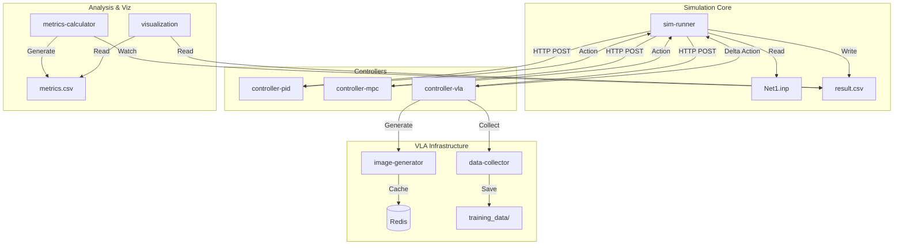

# Water Distribution Control System Simulation

EPANETを用いた水理シミュレーションと、外部のPythonベースの制御ロジック（PID、MPC、VLA）を疎結合で連携させるシミュレーション基盤です。Docker Compose上で動作し、リアルタイムに近い「Sense-Decide-Actuate」ループを再現します。

## 主な特徴

- ✅ **複数の制御手法**: PID、MPC、VLA (Vision-Language-Action)
- ✅ **圧力制御・流量制御の両対応**
- ✅ **単一ループ・複数ループ（分散制御）の両対応**
- ✅ **リアルタイム性能評価と3D可視化**
- ✅ **画像ベースの強化学習対応**（VLAコントローラー）
- ✅ **自動メトリクス計算とトレーニングログ**

---

## システム構成

システムは以下のコンテナサービスで構成されています：

### コアサービス

1. **sim-runner** - EPANETシミュレータ実行エンジン（物理環境）
2. **controller-pid** - PID制御アルゴリズム
3. **controller-mpc** - モデル予測制御（MPC）
4. **controller-vla** - Vision-Language-Action制御（強化学習）
5. **metrics-calculator** - 制御性能指標の自動計算
6. **visualization** - Streamlit可視化ダッシュボード

### VLA支援サービス

7. **redis** - 画像キャッシュストレージ
8. **image-generator** - ネットワーク状態の可視化画像生成
9. **data-collector** - 学習データ収集・保存

### アーキテクチャ図



---

## クイックスタート

### 前提条件

- Docker Compose または Podman Compose
- `shared/networks/Net1.inp` (EPANETサンプルファイル)

### 1. PID制御の実行（圧力制御）

```bash
# デフォルト: PID圧力制御
docker-compose up --build
```

### 2. MPC制御の実行

```bash
# .envファイルを作成
cat > .env << 'EOF'
EXP_ID=exp_mpc_001
EXP_CONFIG_FILE=exp_mpc.json
CONTROLLER_HOST=controller-mpc
EOF

docker-compose up --build
```

### 3. VLA制御の実行

```bash
# .envファイルを作成
cat > .env << 'EOF'
EXP_ID=simplednn_001
EXP_CONFIG_FILE=exp_vla.json
CONTROLLER_HOST=controller-vla
VLA_MODEL=simple_dnn
EOF

# VLA関連サービスも起動
docker-compose up --build
```

### 4. 結果の確認

ブラウザで http://localhost:8501 にアクセス

---

## サービス詳細

### 1. sim-runner (シミュレーション実行エンジン)

**役割**: 物理環境（配水ネットワーク）のシミュレーション

**主な機能**:
- EPANETモデル（.inp）の読み込みと実行
- 水理計算（圧力、流量）の実施
- センサーデータの取得とコントローラーへの送信
- コントローラーからの制御指令（バルブ開度）の適用
- 結果のCSV出力（result.csv）

**実装**: `/sim-runner/main.py`

**入力**:
- EPANET INPファイル (`shared/networks/*.inp`)
- 設定JSON (`shared/configs/*.json`)
- コントローラーからのHTTPレスポンス

**出力**:
- `result.csv` - タイムステップごとのシミュレーション結果

**接続先**:
- controller-pid / controller-mpc / controller-vla (HTTP POST)

---

### 2. controller-pid (PID制御)

**役割**: 古典的PID制御アルゴリズムの提供

**主な機能**:
- センサーデータの受信
- PID計算（比例・積分・微分）
- バルブ開度の決定
- 複数ループの独立制御

**実装**: `/controller-pid/app.py`

**API**:
- `POST /control` - 制御計算
- `GET /status` - ステータス確認
- `POST /reset` - リセット

**入力**:
```json
{
  "sensor_data": [
    {
      "loop_id": "loop_1",
      "pressure": 127.5,
      "target": 120.0,
      "prev_action": 1.0
    }
  ]
}
```

**出力**:
```json
{
  "actions": [
    {
      "loop_id": "loop_1",
      "action": 1.05,
      "p_term": 0.15,
      "i_term": 0.02,
      "d_term": -0.01,
      "error": 7.5
    }
  ]
}
```

---

### 3. controller-mpc (モデル予測制御)

**役割**: 予測モデルを用いた最適制御

**主な機能**:
- 一次遅れ系モデルによる予測
- ホライゾン内での最適化計算
- 制約条件の考慮
- 複数ループの独立制御

**実装**: `/controller-mpc/app.py`

**API**: controller-pidと同じ形式

**特徴**:
- モデルベースの予測制御
- 目的関数の最小化
- 制約の明示的な扱い

---

### 4. controller-vla (Vision-Language-Action制御)

**役割**: 画像とテキストを入力とする強化学習ベースの制御

**主な機能**:
- ネットワーク状態画像の取得
- VLAモデルによる行動推論
- SAC（Soft Actor-Critic）による学習
- エピソード統計の計算・保存

**実装**: `/controller-vla/`
- `app.py` - Flaskアプリケーション
- `training/controller.py` - VLAController
- `models/simple_dnn.py` - SimpleDNN VLAモデル
- `agents/sac_agent.py` - SAC学習アルゴリズム

**API**:
- `POST /control` - 制御計算（個別リクエスト）

**入力**:
```json
{
  "loop_id": "loop_1",
  "pressure": 127.5,
  "target": 120.0,
  "prev_action": 1.0,
  "step": 0,
  "time_step": 0
}
```

**出力**:
```json
{
  "delta_action": 0.015
}
```

**学習データ出力**:
- `training_steps.csv` - ステップごとの詳細ログ
- `training_episodes.csv` - エピソード統計

**依存サービス**:
- redis（画像キャッシュ）
- image-generator（画像生成）
- data-collector（データ収集）

---

### 5. redis (画像キャッシュ)

**役割**: VLA制御用の画像データのキャッシュストレージ

**主な機能**:
- 生成された画像のバイナリデータ保存
- 高速な画像取得
- 揮発性ストレージ（再起動でクリア）

**実装**: Redis公式イメージ（redis:7-alpine）

**データ構造**:
```
key: {exp_id}:step_{step}:{image_type}
value: PNG画像のバイナリデータ
```

**例**:
```
simplednn_001:step_0:system_ui
simplednn_001:step_0:valve_detail
simplednn_001:step_0:flow_dashboard
simplednn_001:step_0:comparison
```

---

### 6. image-generator (画像生成サービス)

**役割**: ネットワーク状態の可視化画像を生成

**主な機能**:
- 4種類の可視化画像の生成
  - `system_ui`: システム全体のUI
  - `valve_detail`: バルブ詳細
  - `flow_dashboard`: 流量ダッシュボード
  - `comparison`: 目標値との比較
- Redisへの画像保存

**実装**: `/image-generator/app.py`

**API**:
- `POST /generate` - 画像生成リクエスト

**入力**:
```json
{
  "exp_id": "simplednn_001",
  "step": 0,
  "state": {
    "pressure": 127.5,
    "target": 120.0,
    "valve_setting": 1.0
  }
}
```

**出力**:
```json
{
  "status": "success",
  "redis_keys": {
    "system_ui": "simplednn_001:step_0:system_ui",
    "valve_detail": "simplednn_001:step_0:valve_detail",
    "flow_dashboard": "simplednn_001:step_0:flow_dashboard",
    "comparison": "simplednn_001:step_0:comparison"
  }
}
```

---

### 7. data-collector (データ収集サービス)

**役割**: VLA学習用のデータセット生成

**主な機能**:
- 状態・行動・報酬の記録
- 画像参照（Redisキー）の保存
- JSON形式でのエクスポート

**実装**: `/data-collector/app.py`

**API**:
- `POST /collect` - データ収集リクエスト

**入力**:
```json
{
  "exp_id": "simplednn_001",
  "step": 0,
  "time_step": 0,
  "state": {
    "pressure": 127.5,
    "target": 120.0
  },
  "action": {
    "delta_action": 0.015
  },
  "reward": -0.5,
  "images": {
    "system_ui": "simplednn_001:step_0:system_ui"
  }
}
```

**出力先**:
```
shared/training_data/{exp_id}/
├── step_000000.json
├── step_000001.json
├── ...
└── metadata.json
```

---

### 8. metrics-calculator (メトリクス計算サービス)

**役割**: 制御性能指標の自動計算

**主な機能**:
- result.csvの監視（5秒ごとのポーリング）
- ループごとの性能指標計算
- 全体統合指標の計算
- metrics.csvの自動生成

**実装**: `/metrics/analyze.py`

**計算指標**:
- MAE, RMSE, MaxError
- IAE, ISE
- SteadyMAE, SteadyRMSE
- TotalVariation（バルブ操作量）

**入力**: `result.csv`

**出力**: `metrics.csv`

**処理フロー**:
1. result.csvを検出
2. ループごとに指標を計算
3. 全体統合指標を計算
4. metrics.csvに保存

---

### 9. visualization (可視化ダッシュボード)

**役割**: Streamlitベースのインタラクティブな可視化

**主な機能**:
- 3Dネットワーク可視化
- 制御性能グラフ
- 時系列分析
- メトリクス表示

**実装**: `/visualization/`
- `app.py` - メインエントリーポイント
- `tabs/` - 各タブの実装
- `utils/` - ユーティリティ

**アクセス**: http://localhost:8501

**タブ構成**:
1. **Network 3D**: ネットワークトポロジー
2. **Control Performance**: 制御追従性能
3. **Time Series**: カスタム時系列分析
4. **Metrics**: 性能指標サマリー

---

## データフロー

### PID/MPC制御の場合

```
[sim-runner]
    │
    ├─ 1. センサーデータ読取
    │     (圧力、流量)
    │
    ├─ 2. HTTP POST
    │     ↓
    [controller-pid/mpc]
    │     │
    │     ├─ PID/MPC計算
    │     │
    │     └─ 3. バルブ開度
    │           ↓
    [sim-runner]
    │     │
    │     ├─ 4. バルブ開度適用
    │     ├─ 5. 水理計算実行
    │     └─ 6. result.csv出力
    │           ↓
    [metrics-calculator]
    │     │
    │     └─ 7. metrics.csv生成
    │           ↓
    [visualization]
          │
          └─ 8. ダッシュボード表示
```

### VLA制御の場合

```
[sim-runner]
    │
    ├─ 1. センサーデータ読取
    │     (圧力、流量)
    │
    ├─ 2. HTTP POST
    │     ↓
    [controller-vla]
    │     │
    │     ├─ 3. 画像生成リクエスト
    │     │     ↓
    │     [image-generator]
    │     │     │
    │     │     ├─ 画像生成
    │     │     │   (system_ui, valve_detail,
    │     │     │    flow_dashboard, comparison)
    │     │     │
    │     │     └─ 4. Redis保存
    │     │           ↓
    │     │     [redis]
    │     │
    │     ├─ 5. 画像取得（Redis）
    │     ├─ 6. VLAモデル推論
    │     │     (SimpleDNN/OpenVLA)
    │     ├─ 7. SAC学習
    │     │
    │     ├─ 8. データ収集リクエスト
    │     │     ↓
    │     [data-collector]
    │     │     │
    │     │     └─ 9. JSON保存
    │     │           (training_data/)
    │     │
    │     └─ 10. delta_action返却
    │           ↓
    [sim-runner]
    │     │
    │     ├─ 11. バルブ開度更新
    │     │      (current + delta)
    │     ├─ 12. 水理計算実行
    │     └─ 13. result.csv出力
    │           ↓
    [controller-vla]
    │     │
    │     └─ 14. training_steps.csv
    │            training_episodes.csv生成
    │           ↓
    [metrics-calculator]
    │     │
    │     └─ 15. metrics.csv生成
    │           ↓
    [visualization]
          │
          └─ 16. ダッシュボード表示
```

---

## ポート割り当て

| サービス | ホストポート | コンテナポート | プロトコル |
|:---|:---:|:---:|:---|
| controller-pid | 5000 | 5000 | HTTP |
| controller-mpc | 5001 | 5000 | HTTP |
| controller-vla | 5002 | 5000 | HTTP |
| image-generator | 5003 | 5000 | HTTP |
| data-collector | 5004 | 5000 | HTTP |
| redis | 6379 | 6379 | Redis |
| visualization | 8501 | 8501 | HTTP |

---

## ドキュメント

- 📖 **[設定ファイル詳細](docs/CONFIGURATION.md)** - 各パラメータの説明とチューニングガイド
- 🎮 **[コントローラー詳細](docs/CONTROLLERS.md)** - PID、MPC、VLAの実装と使い方
- 🤖 **[VLAセットアップガイド](docs/VLA_SETUP.md)** - Vision-Language-Action制御の詳細
- 📊 **[メトリクス詳細](docs/METRICS.md)** - 性能評価指標の説明
- 📈 **[可視化ガイド](docs/VISUALIZATION.md)** - ダッシュボードの使い方
- 🛠️ **[開発ガイド](docs/DEVELOPMENT.md)** - 新機能追加とトラブルシューティング

---

## 制御フロー

タイムステップごとに以下のサイクルを繰り返します：

1. **Sense (観測)** - センサーデータ取得（圧力、流量）
2. **Decide Request (意思決定要求)** - コントローラーへHTTP POST
3. **Control Calculation (制御計算)** - 最適な操作量を計算
4. **Actuate (操作)** - バルブ開度をEPANETモデルに適用

### コントローラー別の特徴

| コントローラー | 入力 | 出力 | 学習 | 用途 |
|:---|:---|:---|:---|:---|
| **PID** | 圧力/流量 | バルブ開度 | なし | 単純な制御問題 |
| **MPC** | 圧力/流量 | バルブ開度 | なし | 予測制御・制約あり |
| **VLA** | 画像+テキスト | バルブ開度変化 | あり | 複雑な視覚的判断 |

---

## 出力データ

### result.csv
各タイムステップの詳細なシミュレーション結果

### metrics.csv
制御性能の評価指標（MAE、RMSE、IAE、ISE等）

### training_episodes.csv（VLAのみ）
エピソードごとの学習統計

### training_steps.csv（VLAのみ）
ステップごとの詳細なトレーニングログ

---

## ディレクトリ構造

```
.
├── README.md                 # このファイル
├── docs/                     # ドキュメント
│   ├── CONFIGURATION.md
│   ├── CONTROLLERS.md
│   ├── VLA_SETUP.md
│   ├── METRICS.md
│   ├── VISUALIZATION.md
│   └── DEVELOPMENT.md
├── controller-pid/           # PID制御
├── controller-mpc/           # MPC制御
├── controller-vla/           # VLA制御（強化学習）
│   ├── app.py
│   ├── models/               # VLAモデル
│   ├── training/             # 学習ロジック
│   └── utils/
├── sim-runner/               # シミュレーション実行
├── image-generator/          # 画像生成
├── data-collector/           # データ収集
├── metrics/                  # メトリクス計算
├── visualization/            # 可視化
└── shared/                   # 共有データ
    ├── configs/              # 設定ファイル
    ├── networks/             # EPANETモデル
    ├── results/              # 実験結果
    └── training_data/        # 学習データ（VLA）
```

---

## 変更履歴

### v3.0.0 (2025-12-01)
- ✨ VLA (Vision-Language-Action) コントローラーの追加
- ✨ 画像生成・データ収集サービスの追加
- ✨ エピソード統計の自動計算
- 🔧 sim-runnerのコントローラータイプ自動判定
- 📚 ドキュメントの分割・整理

### v2.0.0 (2025-11-23)
- 流量制御モードの追加
- 複数ループ（分散制御）の対応
- メトリクス計算の拡張

### v1.0.0 (初版)
- 基本的な圧力制御（単一ループ）
- PID/MPC コントローラ