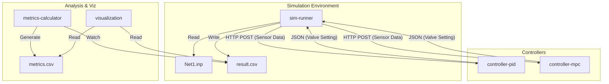

# **Water Distribution Control System Simulation**

EPANETを用いた水理シミュレーションと、外部のPythonベースの制御ロジック（PID, MPC）を疎結合で連携させるシミュレーション基盤です。Podman Compose (Docker Compose) 上で動作し、リアルタイムに近い「Sense-Decide-Actuate」ループを再現します。

**主な特徴:**
- 圧力制御・流量制御の両対応
- 単一ループ・複数ループ（分散制御）の両対応
- PID・MPC両方のコントローラ実装
- リアルタイム性能評価と3D可視化

## **システム構成**

システムは以下の5つのコンテナサービスで構成されています。

1. **sim-runner**: EPANETシミュレータ実行エンジン。物理環境（プラント）の役割を果たします。  
2. **controller-pid**: PID制御アルゴリズムを提供するREST APIサーバー。  
3. **controller-mpc**: モデル予測制御（MPC）を提供するREST APIサーバー。  
4. **metrics-calculator**: 生成されたシミュレーション結果を監視し、制御性能指標（RMSE, MAE等）を自動計算するバックグラウンドサービス。  
5. **visualization**: Streamlitを用いた可視化ダッシュボード。3Dネットワーク図や時系列グラフを表示します。

### **アーキテクチャ図**



## **制御フロー (Control Loop)**

本システムは、タイムステップごとに以下のサイクルを繰り返します。

1. **Sense (観測)**:  
   - sim-runner が現在のシミュレーション時刻におけるセンサーデータ（特定のノードの圧力、リンクの流量）を取得します。  

2. **Decide Request (意思決定要求)**:  
   - sim-runner は、有効なコントローラ（PID または MPC）のAPIエンドポイントへHTTP POSTリクエストを送信します。  
   - ペイロードには「現在の制御対象値（圧力または流量）」「目標値」「前回のバルブ開度」が含まれます。  

3. **Control Calculation (制御計算)**:  
   - コントローラは受信したデータに基づき、次のタイムステップで適用すべき「バルブ開度 (0.0〜1.0)」を計算して返答します。  

4. **Actuate (操作)**:  
   - sim-runner は受け取ったバルブ開度をEPANETモデルに適用し、水理計算を1ステップ進めます。

## **制御モード**

本システムは2つの制御モードをサポートしています：

- **圧力制御 (Pressure Control)**: 特定ノードの圧力を目標値に追従させます
- **流量制御 (Flow Control)**: 特定リンクの流量を目標値に追従させます

制御モードは設定ファイルの `control_mode` パラメータで指定します。

## **制御ループ構成**

### **単一ループ制御**
1つのセンサーと1つのアクチュエータによる基本的な制御ループ。

### **複数ループ制御（分散制御）**
複数のセンサー-アクチュエータペアを独立して制御。各ループは以下を持ちます：
- 独立したセンサーノード
- 独立したアクチュエータバルブ
- 独立した制御パラメータ（PIDゲイン、MPC設定）
- 独立した目標値

**注意**: 現在の実装は分散制御（各ループが独立）です。ループ間の相互作用は考慮されません。

## **クイックスタート**

### **前提条件**

- Podman Compose または Docker Compose  
- shared/networks/ ディレクトリに Net1.inp (EPANETサンプルファイル) が配置されていること。

### **1. PID制御の実行 (デフォルト - 圧力制御)**

デフォルトでは controller-pid が使用され、圧力制御が実行されます。

```bash
podman-compose up --build
```

### **2. 流量制御の実行**

設定ファイルで `control_mode` を `"flow"` に設定します。

```bash
# 流量制御用の設定ファイルを使用
EXP_CONFIG_FILE=exp_flow_control.json \
EXP_ID=exp_flow_01 \
CONTROLLER_HOST=controller-pid \
podman-compose up --build
```

### **3. MPC制御の実行**

環境変数を切り替えることで、接続先のコントローラと設定ファイルを変更します。

```bash
# MPC用設定とコントローラホストを指定
EXP_CONFIG_FILE=exp_mpc.json \
EXP_ID=exp_mpc_01 \
CONTROLLER_HOST=controller-mpc \
podman-compose up --build
```

### **4. 複数ループ制御の実行**

複数ループの設定ファイルを使用します。

```bash
EXP_CONFIG_FILE=exp_multi_loop.json \
EXP_ID=exp_multi_01 \
CONTROLLER_HOST=controller-pid \
podman-compose up --build
```

### **5. 結果の確認**

ブラウザで http://localhost:8501 にアクセスし、Visualizationダッシュボードを開きます。

## **設定ファイル詳細 (Configuration)**

実験設定は shared/configs/\*.json で管理されます。

### **単一ループ設定の全体構造**

```json
{
  "control_mode": "pressure",
  "network": { ... },
  "simulation": { ... },
  "target": { ... },
  "actuator": { ... },
  "pid_params": { ... },
  "mpc_params": { ... }
}
```

### **複数ループ設定の全体構造**

```json
{
  "control_mode": "pressure",
  "network": { ... },
  "simulation": { ... },
  "control_loops": [
    {
      "loop_id": "loop_1",
      "target": { ... },
      "actuator": { ... },
      "pid_params": { ... }
    },
    {
      "loop_id": "loop_2",
      "target": { ... },
      "actuator": { ... },
      "pid_params": { ... }
    }
  ]
}
```

### **制御モード設定 (control_mode)**

| パラメータ | 値 | 説明 |
|:---|:---|:---|
| control_mode | "pressure" | 圧力制御モード（デフォルト） |
|  | "flow" | 流量制御モード |

### **基本構造 (simulation, network)**

#### **simulation**

| パラメータ | 説明 | 推奨値 |
|:---|:---|:---|
| duration | シミュレーション総時間（秒） | 86400 (24時間) |
| hydraulic_step | 水理計算および制御のタイムステップ（秒）<br>小さいほど精密だが計算時間増 | 300〜3600 (5分〜1時間) |

#### **network**

| パラメータ | 説明 |
|:---|:---|
| inp_file | 使用するEPANETネットワークファイル名<br>例: "Net1.inp" |

### **単一ループ設定 (target, actuator)**

#### **target**

| パラメータ | 説明 | 制御モード |
|:---|:---|:---|
| node_id | 制御目標とする観測ノードID | 両方 |
| target_pressure | 目標圧力値 (m)<br>高すぎると管破損リスク、低すぎると供給不足 | pressure |
| target_flow | 目標流量値 (m³/h または L/s)<br>需要に応じて設定 | flow |

#### **actuator**

| パラメータ | 説明 |
|:---|:---|
| link_id | 操作対象となるバルブ（リンク）ID |
| initial_setting | シミュレーション開始時のバルブ初期開度 (0.0〜1.0)<br>0.5 (半開) が一般的 |

### **複数ループ設定 (control_loops)**

`control_loops`配列の各要素は以下の構造を持ちます：

| パラメータ | 説明 |
|:---|:---|
| loop_id | ループの識別子（例: "loop_1", "loop_2"） |
| target | このループの観測ノードと目標値 |
| actuator | このループの制御バルブ |
| pid_params | このループのPID制御パラメータ（オプション） |
| mpc_params | このループのMPC制御パラメータ（オプション） |

**複数ループ設定例:**

```json
{
  "control_mode": "pressure",
  "simulation": {
    "duration": 86400,
    "hydraulic_step": 3600
  },
  "network": {
    "inp_file": "Net1.inp"
  },
  "control_loops": [
    {
      "loop_id": "loop_1",
      "target": {
        "node_id": "2",
        "target_pressure": 30.0
      },
      "actuator": {
        "link_id": "10",
        "initial_setting": 0.5
      },
      "pid_params": {
        "Kp": 0.02,
        "Ki": 0.001,
        "Kd": 0.05
      }
    },
    {
      "loop_id": "loop_2",
      "target": {
        "node_id": "5",
        "target_pressure": 25.0
      },
      "actuator": {
        "link_id": "12",
        "initial_setting": 0.6
      },
      "pid_params": {
        "Kp": 0.03,
        "Ki": 0.002,
        "Kd": 0.06
      }
    }
  ]
}
```

### **PID制御用設定 (pid_params)**

controller-pid を使用する場合に参照されます。

#### **基本パラメータ**

| パラメータ | 説明 | チューニング指針 |
|:---|:---|:---|
| Kp (または kp) | **比例ゲイン**<br>現在の偏差に対する操作量の強さ | 大: 応答速度↑、振動リスク↑<br>小: 安定↑、応答速度↓ |
| Ki (または ki) | **積分ゲイン**<br>過去の累積偏差に対する補正（定常偏差除去） | 大: 定常偏差除去↑、振動リスク↑<br>小: 安定↑、定常偏差残存 |
| Kd (または kd) | **微分ゲイン**<br>偏差の変化率に対する反応（オーバーシュート抑制） | 大: オーバーシュート抑制↑、ノイズ増幅<br>小: 滑らか、オーバーシュート許容 |
| setpoint | 目標値（通常は target の値と同じ） | target_pressure または target_flow と一致 |

#### **モード別パラメータ（オプション）**

流量制御と圧力制御で異なるゲインを使用する場合：

| パラメータ | 説明 |
|:---|:---|
| kp_flow, ki_flow, kd_flow | 流量制御専用のPIDゲイン |
| setpoint_flow | 流量制御時の目標値 |

**設定例 (圧力制御):**

```json
"pid_params": {
    "Kp": 0.5,
    "Ki": 0.1,
    "Kd": 0.05,
    "setpoint": 30.0
}
```

**設定例 (流量制御):**

```json
"pid_params": {
    "Kp": 0.01,
    "Ki": 0.001,
    "Kd": 0.02,
    "kp_flow": 0.01,
    "ki_flow": 0.001,
    "kd_flow": 0.02,
    "setpoint_flow": 100.0
}
```

### **MPC制御用設定 (mpc_params)**

controller-mpc を使用する場合に参照されます。本システムでは、内部モデルとして「一次遅れ系 (First-Order Lag Process)」を仮定しています。

#### **基本パラメータ**

| パラメータ | 説明 | チューニング指針 |
|:---|:---|:---|
| horizon | **予測ホライゾン**<br>何ステップ先まで予測して最適化するか | 大: 最適性↑、計算時間↑<br>小: 計算速度↑、最適性↓<br>推奨: 5〜20 |
| dt | 内部モデルで使用するタイムステップ（秒） | simulation.hydraulic_step と一致させる |
| tau | **時定数** (τ)<br>システムが入力変化に対して63.2%応答するまでの時間（秒） | システムの反応速度を表す<br>実験的に同定が必要 |
| K | **プロセスゲイン** (K)<br>バルブ開度が1単位変化したとき、制御対象値がどれだけ変化するか | システムの感度を表す<br>実験的に同定が必要 |
| weight_error | 目的関数における「目標追従誤差」の重み | 大: 追従性重視↑、操作量増<br>小: 追従性↓、操作量減 |
| weight_du | 目的関数における「操作量変化」(Δu) の重み | 大: バルブ動作滑らか↑、応答遅<br>小: 応答速↑、バルブ動作激化 |

#### **モード別パラメータ（オプション）**

流量制御と圧力制御で異なるモデルパラメータを使用する場合：

| パラメータ | 説明 |
|:---|:---|
| tau_flow, K_flow | 流量制御専用のモデルパラメータ |
| weight_error_flow, weight_du_flow | 流量制御専用の重み係数 |

**設定例 (圧力制御):**

```json
"mpc_params": {
    "horizon": 10,
    "dt": 300,
    "tau": 1800.0,
    "K": 50.0,
    "weight_error": 1.0,
    "weight_du": 10.0
}
```

**設定例 (流量制御):**

```json
"mpc_params": {
    "horizon": 10,
    "dt": 300,
    "tau": 1200.0,
    "K": 30.0,
    "tau_flow": 1200.0,
    "K_flow": 30.0,
    "weight_error": 1.0,
    "weight_du": 0.5
}
```

## **出力データ**

### **result.csv**

各タイムステップの詳細なシミュレーション結果。

| カラム | 説明 |
|:---|:---|
| Time | シミュレーション時刻（秒） |
| LoopID | ループ識別子（複数ループの場合のみ） |
| Pressure | 観測ノードの圧力 (m) |
| Flow | 観測リンクの流量 (m³/h) |
| ControlMode | 制御モード ("pressure" or "flow") |
| ControlledValue | 実際に制御している値 |
| TargetValue | 現在の目標値 |
| TargetPressure | 圧力の目標値 |
| TargetFlow | 流量の目標値 |
| ValveSetting | 現在のバルブ開度 (0.0〜1.0) |
| NewValveSetting | 次ステップのバルブ開度 |
| PID_P, PID_I, PID_D | PIDの各項（PID制御時のみ） |
| Error | 制御誤差（目標値 - 現在値） |

### **metrics.csv**

制御性能の評価指標を自動計算した結果。

#### **基本情報**

| メトリクス | 説明 |
|:---|:---|
| SourceFile | 元となる result.csv のファイル名 |
| ProcessedAt | 処理日時 |
| LoopID | ループ識別子（"default", "loop_1", "ALL"など） |
| ControlMode | 制御モード |
| DurationSec | シミュレーション時間（秒） |
| NumLoops | ループ数（全体指標のみ） |

#### **制御性能指標**

| メトリクス | 説明 | 評価 |
|:---|:---|:---|
| **TargetValue** | 目標値 | - |
| **MeanControlledValue** | 制御対象値の平均 | 目標値に近いほど良好 |
| **MAE**<br>(Mean Absolute Error) | 平均絶対誤差<br>$\frac{1}{n}\sum \|e(t)\|$ | **低いほど良好**<br>全体的な追従精度を表す<br>0に近いほど正確 |
| **RMSE**<br>(Root Mean Square Error) | 二乗平均平方根誤差<br>$\sqrt{\frac{1}{n}\sum e(t)^2}$ | **低いほど良好**<br>大きな誤差を重視<br>MAEより大きな誤差に敏感 |
| **MaxError** | 最大絶対誤差 | **低いほど良好**<br>最悪ケースの性能 |
| **IAE**<br>(Integral Absolute Error) | 積分絶対誤差<br>$\int \|e(t)\| dt$ | **低いほど良好**<br>累積的な制御精度 |
| **ISE**<br>(Integral Square Error) | 積分二乗誤差<br>$\int e(t)^2 dt$ | **低いほど良好**<br>大きな誤差を重視した累積指標 |

#### **定常状態性能**

| メトリクス | 説明 | 評価 |
|:---|:---|:---|
| **SteadyMAE** | 後半50%のデータでの平均絶対誤差 | **低いほど良好**<br>定常状態での精度 |
| **SteadyRMSE** | 後半50%のデータでの二乗平均平方根誤差 | **低いほど良好**<br>定常状態の安定性 |

#### **制御努力**

| メトリクス | 説明 | 評価 |
|:---|:---|:---|
| **TotalVariation** | バルブ開度変化の総和<br>$\sum \|\Delta u(t)\|$ | **低いほど良好**<br>バルブの摩耗・寿命に影響<br>高いと頻繁に動作 |
| **MeanValve** | 平均バルブ開度 | 0.5付近が望ましい<br>0/1に偏ると調整余地なし |

#### **システム状態**

| メトリクス | 説明 |
|:---|:---|
| MeanPressure | 平均圧力値 (m) |
| MeanFlow | 平均流量値 (m³/h) |

#### **複数ループの場合の特殊な行**

`LoopID = "ALL"` の行には、全ループを統合した指標が記録されます：

- **MAE, RMSE, SteadyMAE, SteadyRMSE**: 各ループの平均値
- **MaxError**: 全ループの最大値
- **IAE, ISE, TotalVariation**: 各ループの合計値
- **NumLoops**: 制御ループの総数

## **Visualization機能**

Streamlitダッシュボード (http://localhost:8501) では以下の機能を提供します。

### **アーキテクチャ**

可視化サービスは機能ごとにモジュール分割されています：

```
visualization/
├── app.py                     # メインエントリーポイント
├── utils/
│   ├── constants.py           # 定数定義
│   ├── data_loader.py         # データ読み込み
│   └── inp_parser.py          # INPファイル解析
└── tabs/
    ├── network_3d.py          # 3D可視化
    ├── control_performance.py # 制御性能グラフ
    ├── time_series.py         # 時系列分析
    └── metrics_view.py        # メトリクス表示
```

### **Tab 1: 3D Network Visualization**

- **ネットワークトポロジーの3D表示**
  - ノードとパイプの空間配置
  - 標高（Z軸）を考慮した立体表示
  
- **制御要素の可視化**
  - 🔴 **赤いダイヤモンド**: 圧力センサー（圧力制御時）
  - 🟣 **紫のダイヤモンド**: 流量センサー（流量制御時）
  - 🟦 **青い四角**: 貯水池（水源）
  - 🟦 **シアンの四角**: タンク（貯水槽）
  - ⚪ **灰色の円**: ジャンクション（配管接続点）
  - 🟧 **太いオレンジ線**: 制御バルブ（アクチュエータ）
  - ⚪ **細い灰色線**: 通常のパイプ

- **複数ループ対応**
  - すべてのセンサーノードとアクチュエータを同時表示
  - 各ループの構成を一覧表示

### **Tab 2: Control Performance**

- **ループ選択機能**（複数ループの場合）
  - "All Loops": 全ループを重ねて表示
  - 個別選択: 特定のループのみ表示

- **制御追従グラフ**: 目標値と実測値の時系列比較
- **バルブ操作量グラフ**: バルブ開度の時間変化
- **システム状態グラフ**: 圧力と流量の両方を表示（複数ループ対応）
- **制御誤差グラフ**: 時間経過に伴う誤差の推移
- **コントローラ内部状態**: PID各項（P, I, D）の可視化

### **Tab 3: Time Series Analysis**

- **ループフィルター機能**（複数ループの場合）
  - 特定ループのデータのみ抽出可能
  
- **カスタムプロット**: 任意のカラムを選択して時系列グラフ作成
  - 複数ループを色分けして表示
  
- **生データ表示**: result.csv の全データをテーブル表示

### **Tab 4: Metrics**

#### **単一ループの場合**
- 性能指標のサマリー表示
  - 制御モード、目標値
  - RMSE, MAE, Max Error
  - バルブ総変動量、定常状態性能
  - 平均圧力・平均流量

#### **複数ループの場合**
- **全体統合指標** (`LoopID = "ALL"`)
  - ループ数
  - 平均RMSE、平均MAE
  - 最大誤差（全ループ中）
  
- **個別ループ性能**
  - 各ループの詳細指標をテーブル表示
  
- **ループ比較バーグラフ**
  - MAE, RMSE, TotalVariation, SteadyMAEを横並び比較
  - ループ間の性能差を視覚的に確認

## **ディレクトリ構造**

```
.
├── controller-pid/           # PID制御ロジックのソースコード
│   ├── app.py               # 分散制御対応
│   └── requirements.txt
├── controller-mpc/           # MPC制御ロジックのソースコード
│   ├── app.py               # 分散制御対応
│   └── requirements.txt
├── sim-runner/               # EPANETシミュレーション実行エンジン
│   ├── main.py              # 複数ループ対応
│   └── requirements.txt
├── metrics/                  # 結果CSVを監視し性能評価を行うコード
│   ├── analysis.py          # ループごと + 全体指標計算
│   └── requirements.txt
├── visualization/            # Streamlitダッシュボード
│   ├── app.py               # メインエントリーポイント
│   ├── utils/               # ユーティリティモジュール
│   │   ├── constants.py
│   │   ├── data_loader.py
│   │   └── inp_parser.py
│   ├── tabs/                # 各タブの実装
│   │   ├── network_3d.py
│   │   ├── control_performance.py
│   │   ├── time_series.py
│   │   └── metrics_view.py
│   └── requirements.txt
├── shared/                   # ホストとコンテナ間で共有されるデータ
│   ├── configs/              # 実験設定JSONファイル
│   │   ├── exp_001.json                # 単一ループ（圧力制御）
│   │   ├── exp_flow_control.json       # 単一ループ（流量制御）
│   │   ├── exp_mpc.json                # MPC制御
│   │   └── exp_multi_loop.json         # 複数ループ
│   ├── networks/             # EPANETモデルファイル (.inp)
│   │   └── Net1.inp
│   └── results/              # 実験IDごとの結果出力先
│       └── exp_001/
│           ├── result.csv
│           ├── metrics.csv
│           └── exp_001_config.json
├── podman-compose.yml
└── README.md
```

## **トラブルシューティング**

### **コントローラに接続できない**

- コンテナが起動しているか確認: `podman ps`
- CONTROLLER_HOST 環境変数が正しいか確認
- ネットワーク接続を確認: `podman logs sim-runner`

### **制御性能が悪い**

- **振動が発生**: PIDゲイン（特にKp, Kd）を下げる、またはweight_duを上げる
- **応答が遅い**: PIDゲインを上げる、またはMPCのhorizonを調整
- **定常偏差が残る**: Ki を上げる
- **複数ループで干渉**: 現在の実装は分散制御のため、各ループのパラメータを個別に調整

### **複数ループが動作しない**

- 設定ファイルに `control_loops` 配列が正しく定義されているか確認
- 各ループの `loop_id` がユニークか確認
- ノードIDとリンクIDがINPファイルに存在するか確認
- ログで "PID Controller Initialized for Loop 'loop_X'" が各ループ分表示されるか確認

### **結果が表示されない**

- シミュレーションが完了しているか確認
- shared/results/ に該当フォルダがあるか確認
- result.csv と metrics.csv が生成されているか確認
- ブラウザキャッシュをクリアして再読み込み

### **メトリクスが計算されない**

- metrics-calculator コンテナが起動しているか確認: `podman logs metrics-calculator`
- result.csv のフォーマットが正しいか確認（必須カラム: Time, ValveSetting）
- ループIDカラムが存在する場合、全行に値が入っているか確認

## **設計の詳細**

### **分散制御アーキテクチャ**

現在の実装は**分散制御（Decentralized Control）**方式を採用しています：

#### **特徴**
- 各制御ループが独立して動作
- ループ間の相互作用は考慮しない
- コントローラ側で複数のPID/MPCインスタンスを辞書管理
- sim-runnerが全ループのデータを一括送信・受信

#### **利点**
- 実装が比較的簡単
- 計算負荷が低い
- スケーラビリティが高い
- 各ループを個別にチューニング可能

#### **制限**
- ループ間の干渉が発生する可能性
- システム全体の最適化はできない
- 水理的な結合（圧力・流量の相互依存）は考慮されない

### **将来の拡張: 集中制御（MIMO-MPC）**

より高度な制御が必要な場合、以下の拡張が考えられます：

- **多入力多出力MPC (MIMO-MPC)**
  - 全ループを統合した状態空間モデル
  - システム全体を最適化
  - ループ間の相互作用を明示的に考慮
  - 実装の複雑度が高い

## **パフォーマンス最適化**

### **シミュレーション速度**

- **hydraulic_step を大きくする**: 精度とのトレードオフ
- **複数ループの場合**: 各ループが独立なため、並列化の余地あり（現状は未実装）

### **メトリクス計算**

- metrics-calculator は5秒ごとにファイルをポーリング
- 大規模実験の場合、ポーリング間隔を調整可能

### **可視化**

- Streamlitはデフォルトでキャッシュを使用
- 大量のデータポイントの場合、サンプリングして表示することを推奨

## **開発ガイド**

### **新しい制御アルゴリズムの追加**

1. 新しいコントローラーサービスを作成（例: `controller-fuzzy/`）
2. `/control` エンドポイントを実装
3. 初期化時に `control_loops` 配列を受け取る
4. `sensor_data` 配列を処理し、`actions` 配列を返す
5. podman-compose.yml に追加

### **新しいメトリクスの追加**

`metrics/analysis.py` の `calculate_loop_metrics()` 関数を拡張：

```python
def calculate_loop_metrics(df_loop, loop_id, control_mode):
    # ... 既存のコード ...
    
    # 新しいメトリクスを追加
    metrics['your_new_metric'] = calculate_your_metric(df_loop)
    
    return metrics
```

### **可視化の拡張**

新しいタブを追加する場合：

1. `visualization/tabs/` に新しいファイルを作成（例: `custom_analysis.py`）
2. `render_custom_analysis()` 関数を実装
3. `app.py` でインポートして呼び出す

```python
from tabs.custom_analysis import render_custom_analysis

# タブに追加
with tab5:
    render_custom_analysis(df, config_data)
```

## **よくある質問 (FAQ)**

### **Q: 圧力制御と流量制御を同時に実行できますか？**
A: 現在の実装では、1つの実験で1つの制御モードのみサポートしています。ただし、複数ループでそれぞれ異なるノード/リンクを制御することは可能です。

### **Q: 複数ループで異なる制御アルゴリズム（PIDとMPC）を混在できますか？**
A: 現状では1つの実験で1つのコントローラーのみ使用可能です。将来的には、ループごとに異なるコントローラーを指定できるように拡張可能です。

### **Q: 何個のループまで対応していますか？**
A: 理論的には無制限ですが、以下の制約があります：
- 計算時間がループ数に比例して増加
- 可視化の見やすさ（10ループ程度が実用的）
- メモリ使用量

### **Q: 実際の配水ネットワークで使用できますか？**
A: 可能ですが、以下を考慮してください：
- EPANETモデルの精度
- 実システムとの時間スケールの違い
- 実際のセンサー・アクチュエータの応答特性
- 現在は分散制御のため、ループ間干渉を考慮していない

### **Q: リアルタイム制御に使用できますか？**
A: 現在の実装はシミュレーション専用です。リアルタイム制御には以下の対応が必要：
- 実センサー・アクチュエータとのインターフェース
- タイミング保証（リアルタイムOS等）
- フェイルセーフ機構
- セキュリティ対策

## **引用・参考文献**

### **EPANET**
- Rossman, L. A. (2000). EPANET 2: Users Manual. U.S. Environmental Protection Agency.

### **PID制御**
- Åström, K. J., & Hägglund, T. (2006). Advanced PID Control. ISA-The Instrumentation, Systems, and Automation Society.

### **モデル予測制御 (MPC)**
- Camacho, E. F., & Bordons, C. (2007). Model Predictive Control. Springer Science & Business Media.

### **配水システム制御**
- Brdys, M. A., & Ulanicki, B. (1994). Operational Control of Water Systems: Structures, Algorithms, and Applications. Prentice Hall.

## **ライセンス**

本プロジェクトはMITライセンスの下で公開されています。

## **コントリビューション**

プルリクエストを歓迎します！以下のガイドラインに従ってください：

1. 機能追加・バグ修正の場合は、まずIssueを作成
2. コードスタイルは既存のコードに準拠
3. 新機能にはテストを追加
4. READMEを適切に更新

## **サポート**

問題が発生した場合：

1. まずこのREADMEのトラブルシューティングセクションを確認
2. ログを確認: `podman logs [service-name]`
3. GitHubのIssueで報告

## **今後の拡張予定**

- [ ] MIMO-MPC（集中制御）の実装
- [ ] ループごとに異なるコントローラーの指定
- [ ] 動的な目標値変更（需要パターン追従）
- [ ] 機械学習ベースの制御アルゴリズム
- [ ] リアルタイムデータ連携
- [ ] クラウドデプロイメント対応
- [ ] 自動パラメータチューニング
- [ ] 複数ネットワークの同時シミュレーション

## **変更履歴**

### v2.0.0 (2025-11-23)
- 流量制御モードの追加
- 複数ループ（分散制御）の対応
- 可視化サービスのモジュール分割
- メトリクス計算の拡張（ループごと + 全体統合）
- 3D可視化の強化（複数センサー・アクチュエータ対応）

### v1.0.0 (初版)
- 基本的な圧力制御（単一ループ）
- PID/MPC コントローラ
- 3D可視化
- メトリクス自動計算